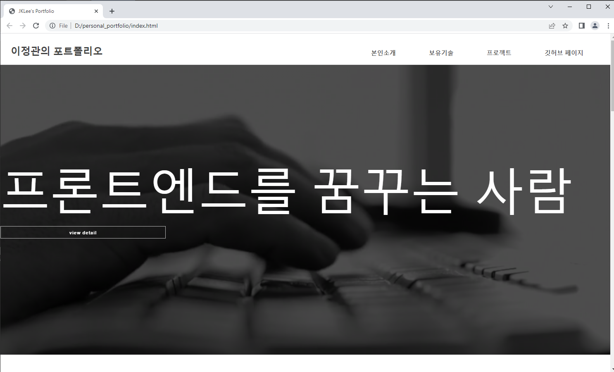
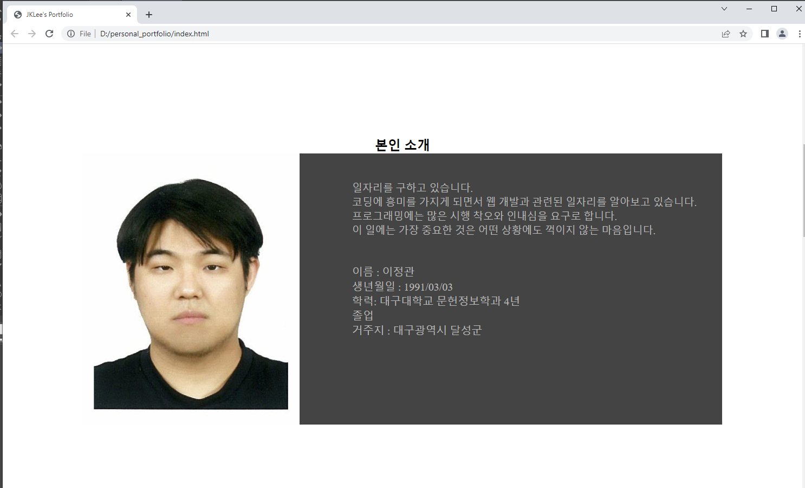
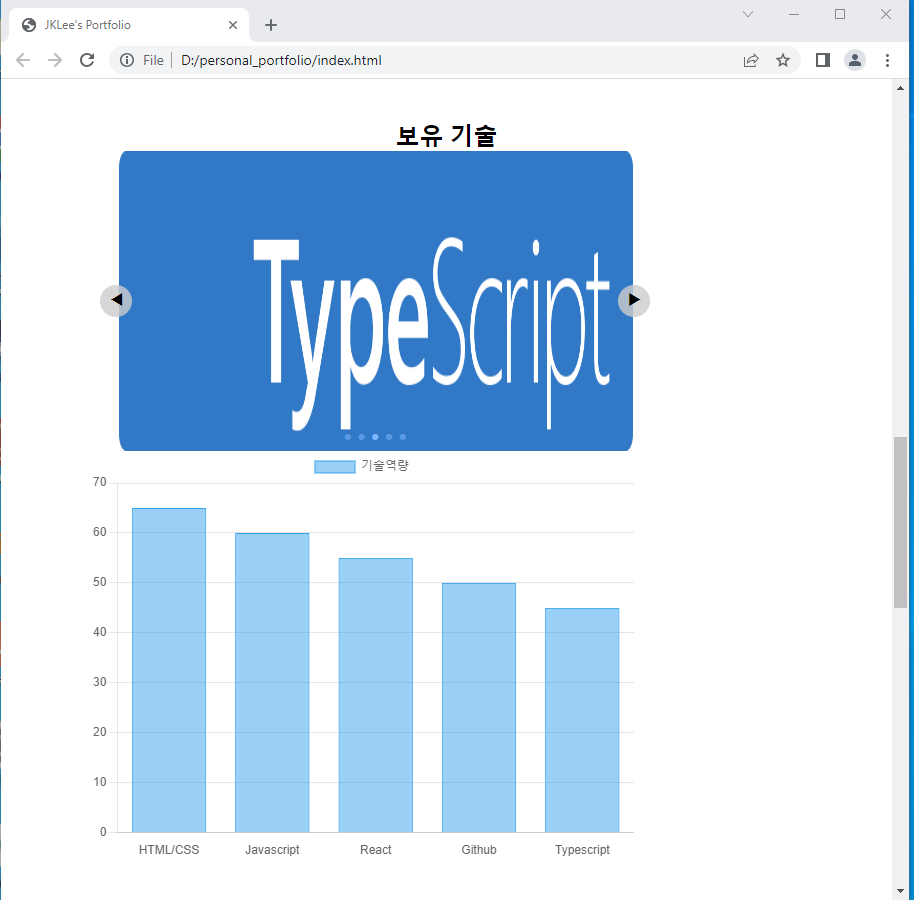
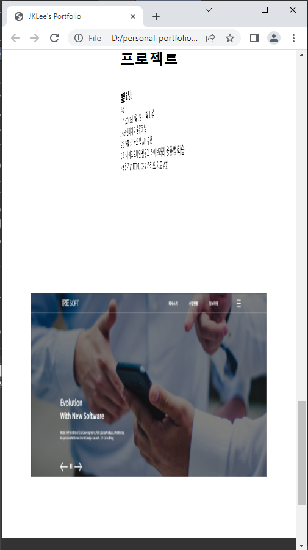

포트폴리오를 위한 공간입니다.

작업 기간: 2023년 7월 3일 ~ 7월 15일 ()

# 개요

인터랙티브 웹 페이지 만들기를 참고해서 웹페이지를 제작했음.

헤더 부분에 있는 메뉴는 해당 버튼을 누르면 링크된 id로 움직인다.

소개 부분은 반응형 웹을 적용시킴으로써 크기를 줄일 수록 이미지가 사라지고 오른쪽에 있는 글들이 중심으로 향한다.

보유기술은 자바스크립트를 통해서 슬라이드를 구현시켰으며 기술역량 점수는 chart.js를 통해서 구현했음.

프로젝트는 카드플립을 통해서 앞면과 뒷면이 마치 카드의 앞면과 뒷면을 보여주는 것처럼 페이지를 구현했음.

## 가장 힘들었던 부분

가장 힘들었던 부분은 자바스크립트로 슬라이드를 구현시키는 것과 반응형을 맞추는 것이었다.

HTML과 CSS는 사용법이 간단하기 때문에 빨리 배울 수가 있다는 장점이 있지만 자바스크립트는 웹 페이지를 움직이게 하는 언어다. 자바스크립트를 통해서 슬라이드를 구현시키는 것은 비전공자에게는 매우 어려운 일이다.

그리고, 반응형 웹은 태블릿과 스마트폰의 보급으로 웹 페이지를 해당 기기의 사이즈에 맞게 웹의 모습을 변형시켜서 접근시키는 방법이다. 그리고, 내가 쓰는 기종은 삼성 갤럭시 S21+로 맞춰져서 반응형 웹이 기종마다 맞추는 것이 어려운 이유를 보여주었다.

## 해결방법
1. 자바스크립트를 해결하는 방법은 구글을 검색해서 슬라이드를 구현시키는 방법을 검색하다가 개발자 데비너스의 개발일지에서 코드를 발견해서 해당 코드를 토대로 슬라이드를 구현했다.

2. 반응형 웹을 내가 쓰는 기종에 맞추기 위해서, CSS의 코드를 수정해야 했었고, 삼성 갤럭시 S21+의 해상도를 검색하고 이를 유추해서 맞췄다.

## 해결여부
1. 자바스크립트로 슬라이드를 구현하는 것에 성공했었다.

2. 반응형 웹을 삼성 갤럭시 S21+의 해상도에 맞춰서 구현하는데 성공했다.

-----------------------------
포트폴리오 제작 연표

2023년 7월 3일
index.html과 css작업을 함. 포트폴리오 작성에 쓸 이미지를 구함.

2023년 7월 4일
section, footer 영역 추가, css 코드 작성. 포트폴리오 작성에 쓸 이미지를 수정.

2023년 7월 5일
career, who, project html 추가, github 페이지 추가, who.css 추가 및 css 코드 수정

2023년 7월 6일
프로젝트에 공간 추가

2023년 7월 7일
default 2 추가, 포트폴리오 변경

2023년 7월 9일
기술역량 부분에 chart.js를 적용

2023년 7월 9일
자기소개 부분 수정

2023년 7월 11일 메뉴 부분 코드 수정

2023년 7월 12일 보유 기술 부분에 자바스크립트 적용
코드 출처는 [개발자 데비너스의 개발일지](https://devinus.tistory.com/48)

2023년 7월 13일 기술역량 부분에 반응형 추가 + 보유 기술 부분 수정, 프로젝트에 flex 적용

2023년 7월 14일 푸터 부분에 반응형 적용

2023년 7월 15일, 갤럭시 S21 반응형 웹 적용 및 코드 수정 + 헤더 부분 반응형 수정, 이력서 부분 링크 추가